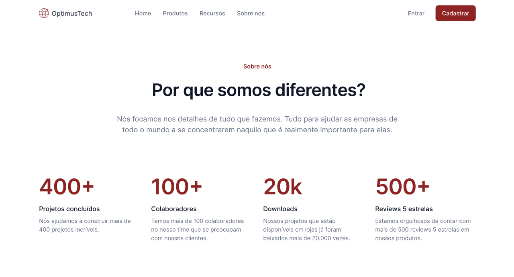

<h1 style="text-align: center">Optimes Tech - Contratação</h1>

Uma empresa de TI quer desenvolver uma página destinada a novas contratações.

## <a href="#status">🚧 Status: Finalizado</a>

### Navegação

- <a href="#functionalities">⚙️ Funcionalidades</a>
- <a href="#figma">📱 Figma</a>
- <a href="#tech">💻 Técnicas e tecnologias utilizadas</a>
- <a href="#acess">📁 Acesso ao projeto</a>
- <a href="#run">👨‍💻 Abrir e rodar o projeto</a>
- <a href="#more">📚 Mais informações do curso</a>
- <a href="#licence">✅ Licença</a>

## <a id="functionalities">⚙️ Funcionalidades</a>

O projeto para empresa OptimesTech foi desenvolvido com o ituito de empregar novos membros a equipe da empresa criando um site para que as pessoas possam se candidatar a vagas de emprego que a empresa disponibiliza.

## <a id="tech">💻 Técnicas e tecnologias utilizadas</a>

HTML: O HTML foi usado para arquitetar o projeto com uma estrutura bem pensada e semântica para a boa leitura da máquina e um bom desenvolvimento do design do projeto com CSS.

CSS: O CSS tem papel fundamental para indicar a interação do usuário com a interface gráfica: o que são links, tamanhos, acessibilidade, responsividade para que o projeto seja acessado por todos com uma boa experiêcia. Para isso usamos algumas técnicas como:

Flex e Grid Responsividade Media Query

## <a id="figma">📱 Figma</a>

Figma do projeto [aqui.](https://www.figma.com/design/nkEfRwDR149c6TRkgFPgU3/01---7daysOfCode---HTML-CSS?node-id=0-1&p=f&t=fnCMVaaNxaoDSBI3-0 "figma do projeto")

## <a id="acess">📁 Acesso ao projeto</a>

Você pode acessar o app clicando [aqui.](https://github.com/VagnerNatvidade/01-7-days-of-code "link do githup").

## <a id="run">👨‍💻 Abrir e rodar o projeto</a>

Apresente as instruções necessárias para abrir e executar o projeto

## <a id="more">📚 Mais informações do curso</a>

Busque na plataforma da Alura o curso HTML e CSS para web e responsividade: crie páginas dinâmicas publicado na Escola Frontend.

## <a id="licence">✅ Licença</a>

MIT License   Copyright (c) 2025 Vagner Junior   Permissão é concedida, gratuitamente, a qualquer pessoa que obtenha uma cópia deste software...
